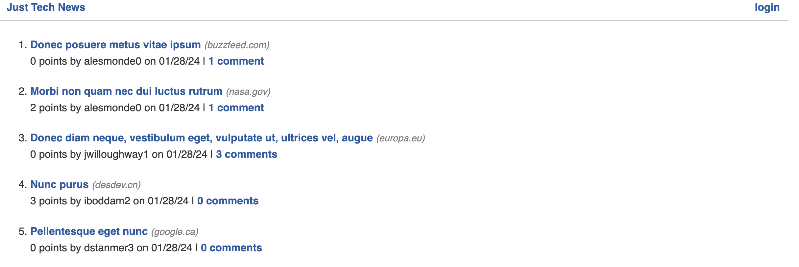

# python-newsfeed

## Description
A news / blog website to make posts, comment on, and upvote posts, all made by using Python. 
  
Motivation: To add another skill set to my coding.  

Why this project: This was a continuing education self-paced course provided by EdX's GW Fullstack Coding Bootcamp. 

What I learned: I learned how to set up a website with Python. It was very interesting to compare some of the differences between JavaScript/Node.js and Python to make a website.  


(lorem ipsum used for seeded examples)

  ## Table of Contents 
  - [Description](#description)
  - [Installation](#installation)
  - [Usage](#usage)
  - [Credits](#credits)
  - [How to Contribute](#how-to-contribute)
  
  - [How to Test](#how-to-test)
  - [Questions](#questions)
  - [Challenges and Future Improvements](#challenges-and-future-improvements)

  ## Installation
  Download the files from this GitHub. Install venv files necessary for making websites based on Python. Furthermore, using pip, install these dependencies:

```
bcrypt, Flask, gunicorn (if you plan to deploy), python-dotenv, SQLAlchemy, sqlalchemy-orm
```

  ## Usage
  Run the command `python3 seeds.py` from the root file to seed your database. Use Flask to run the server from your local machine by changing to a virutal environment with the command `. venv/bin/activate` followed by `python3 -m flask run`. Open the browser: http://127.0.0.1:5000/. This is a locally run server. 

  ## Credits
  EdX Bootcamp Full Stack Web Development Continuation Courses provided the code and I followed step by step to learn how to build a website with Python. 

  ## How to Contribute
  Clone / Fork the project and push changes. Email me (see below) if you want to add anything.

  ## Questions
  [GitHub Profile](https://github.com/uwlryoung)

  If you have any questions, feel free to email uwlryoung@gmail.com

  ## Challenges and Future Improvements 
  Make it so that users can only upvote a post once (currently they can upvote for every time they click 'upvote')
  